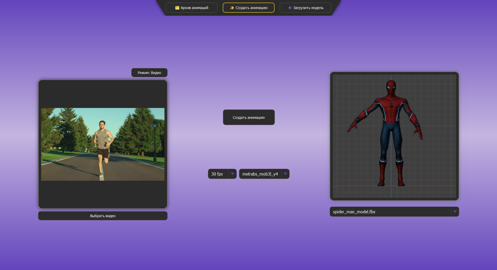
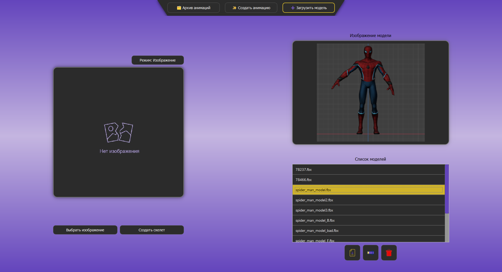

# AniMotion 
**Генератор анимаций на основе детекции ключевых точек тела**

## 📖 Описание  
Это десктопное приложение на Python с GUI-интерфейсом, разработанным с использованием библиотеки PyQt, позволяет анимировать риггованные 3D модели на основе видео.  
Распознавание ключевых точек осуществляется с помощью модели компьютерного зрения [**MeTRAbs**](https://github.com/isarandi/metrabs/tree/master?tab=readme-ov-file#metrabs-absolute-3d-human-pose-estimator).

## 🔧 Основные возможности:

- Загрузка видеофайлов или JSON с ключевыми точками  
- Экспорт 3D-модели  
- Управление списком загруженных 3D-моделей  
- Создание анимации  
- Управление списком результатов  
- Выбор между несколькими предобученными MeTRAbs моделями  

## <link type="image/png" sizes="16x16" rel="icon" href=".../icons8-скриншот-nolan-16.png"> Скриншоты

<h3>✨ Окно создания анимации</h3>

<h3>🗂 Окно с результатами</h3>

<h3>➕ Окно загрузки модели</h3>

